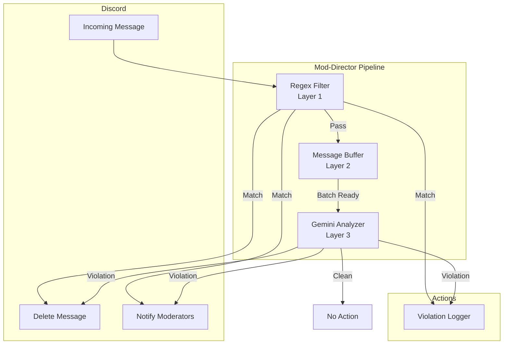

# Design Document: Murdoch Discord Bot

## Overview

Murdoch is a semantic moderation Discord bot implementing a three-layer "Mod-Director" pipeline. The architecture prioritizes cost efficiency through intelligent batching while maintaining low-latency response for obvious violations.

The system processes messages through:
1. **Layer 1 (Regex Filter)**: Instant local pattern matching (~1ms)
2. **Layer 2 (Message Buffer)**: Accumulates messages for batch processing
3. **Layer 3 (Gemini Analyzer)**: AI-powered semantic analysis via Gemini 2.0 Flash

## Architecture



## Components and Interfaces

### RegexFilter

Performs instant pattern matching against configurable regex patterns.

```rust
pub struct RegexFilter {
    patterns: Arc<RwLock<PatternSet>>,
}

pub struct PatternSet {
    slurs: RegexSet,
    invite_links: RegexSet,
    phishing_urls: RegexSet,
}

pub enum FilterResult {
    Violation { reason: String, pattern_type: PatternType },
    Pass,
}

pub enum PatternType {
    Slur,
    InviteLink,
    PhishingUrl,
}

impl RegexFilter {
    pub fn evaluate(&self, content: &str) -> FilterResult;
    pub fn update_patterns(&self, patterns: PatternSet) -> Result<(), MurdochError>;
}
```

### MessageBuffer

Accumulates messages and triggers batch processing based on count or time thresholds.

```rust
pub struct MessageBuffer {
    primary: Arc<Mutex<Vec<BufferedMessage>>>,
    secondary: Arc<Mutex<Vec<BufferedMessage>>>,
    last_flush: Arc<Mutex<Instant>>,
    flush_threshold: usize,  // Default: 10
    timeout_secs: u64,       // Default: 30
}

pub struct BufferedMessage {
    pub message_id: MessageId,
    pub content: String,
    pub author_id: UserId,
    pub channel_id: ChannelId,
    pub timestamp: DateTime<Utc>,
}

pub enum FlushTrigger {
    CountThreshold,
    Timeout,
    Manual,
}

impl MessageBuffer {
    pub fn add(&self, message: BufferedMessage) -> Option<FlushTrigger>;
    pub fn flush(&self) -> Vec<BufferedMessage>;
    pub fn should_flush(&self) -> Option<FlushTrigger>;
}
```

### GeminiAnalyzer

Sends batched messages to Gemini 2.0 Flash for semantic analysis.

```rust
pub struct GeminiAnalyzer {
    client: reqwest::Client,
    api_key: String,
    rate_limiter: RateLimiter,
}

pub struct AnalysisRequest {
    pub messages: Vec<BufferedMessage>,
}

pub struct AnalysisResponse {
    pub violations: Vec<Violation>,
}

pub struct Violation {
    pub message_id: MessageId,
    pub reason: String,
    pub severity: f32,  // 0.0 to 1.0
}

pub enum SeverityLevel {
    High,    // >= 0.7
    Medium,  // 0.4 to 0.7
    Low,     // < 0.4
}

impl GeminiAnalyzer {
    pub async fn analyze(&self, batch: AnalysisRequest) -> Result<AnalysisResponse, MurdochError>;
    pub fn classify_severity(score: f32) -> SeverityLevel;
}
```

### DiscordClient

Handles Discord API interactions for message deletion and moderator notifications.

```rust
pub struct DiscordClient {
    http: Arc<Http>,
    mod_channel_id: ChannelId,
    mod_role_id: RoleId,
    action_queue: Arc<Mutex<VecDeque<PendingAction>>>,
}

pub struct ViolationReport {
    pub message_id: MessageId,
    pub author_id: UserId,
    pub channel_id: ChannelId,
    pub reason: String,
    pub severity: SeverityLevel,
    pub detection_layer: DetectionLayer,
    pub content_hash: String,
    pub timestamp: DateTime<Utc>,
}

pub enum DetectionLayer {
    RegexFilter,
    GeminiAnalyzer,
}

pub enum PendingAction {
    DeleteMessage { channel_id: ChannelId, message_id: MessageId },
    SendNotification { report: ViolationReport },
}

impl DiscordClient {
    pub async fn handle_violation(&self, report: ViolationReport) -> Result<(), MurdochError>;
    pub async fn process_queue(&self) -> Result<(), MurdochError>;
}
```

### Error Types

```rust
#[derive(Debug, thiserror::Error)]
pub enum MurdochError {
    #[error("Gemini API error: {0}")]
    GeminiApi(String),
    
    #[error("Discord API error: {0}")]
    DiscordApi(#[from] serenity::Error),
    
    #[error("Rate limited, retry after {retry_after_ms}ms")]
    RateLimited { retry_after_ms: u64 },
    
    #[error("Configuration error: {0}")]
    Config(String),
    
    #[error("Internal state error: {0}")]
    InternalState(String),
}
```

## Data Models

### Configuration

```rust
pub struct MurdochConfig {
    pub discord_token: String,
    pub gemini_api_key: String,
    pub mod_channel_id: u64,
    pub mod_role_id: u64,
    pub buffer_flush_threshold: usize,
    pub buffer_timeout_secs: u64,
    pub regex_patterns: RegexPatternConfig,
}

pub struct RegexPatternConfig {
    pub slurs: Vec<String>,
    pub invite_links: Vec<String>,
    pub phishing_urls: Vec<String>,
}
```

### Gemini API Request/Response

```rust
#[derive(Serialize)]
pub struct GeminiRequest {
    pub contents: Vec<GeminiContent>,
    pub system_instruction: GeminiSystemInstruction,
}

#[derive(Serialize)]
pub struct GeminiContent {
    pub parts: Vec<GeminiPart>,
}

#[derive(Serialize)]
pub struct GeminiPart {
    pub text: String,
}

#[derive(Deserialize)]
pub struct GeminiResponse {
    pub candidates: Vec<GeminiCandidate>,
}

#[derive(Deserialize)]
pub struct ModerationResult {
    pub violations: Vec<ModerationViolation>,
}

#[derive(Deserialize)]
pub struct ModerationViolation {
    pub message_id: String,
    pub reason: String,
    pub severity: f32,
}
```

## Correctness Properties

*A property is a characteristic or behavior that should hold true across all valid executions of a system—essentially, a formal statement about what the system should do. Properties serve as the bridge between human-readable specifications and machine-verifiable correctness guarantees.*

### Property 1: Pattern Matching Flags Violations

*For any* message content and *for any* configured pattern (slur, invite link, or phishing URL), if the content matches the pattern, the RegexFilter SHALL return a Violation result with the correct pattern type.

**Validates: Requirements 1.2, 1.3, 1.4**

### Property 2: Non-Matching Messages Pass Through

*For any* message content that does not match any configured pattern, the RegexFilter SHALL return a Pass result.

**Validates: Requirements 1.5**

### Property 3: Runtime Pattern Updates Take Effect

*For any* pattern update operation, subsequent evaluations SHALL use the updated patterns without requiring system restart.

**Validates: Requirements 1.6**

### Property 4: Buffer Stores Passed Messages

*For any* message that passes the RegexFilter, the MessageBuffer SHALL store it with all required fields (message ID, content, author ID, channel ID).

**Validates: Requirements 2.1, 2.5**

### Property 5: Double Buffering During Flush

*For any* message received while a flush is in progress, the MessageBuffer SHALL accept it into the secondary buffer without blocking or data loss.

**Validates: Requirements 2.4**

### Property 6: Failed Flush Retains Messages

*For any* flush operation that fails, the MessageBuffer SHALL retain all messages from that batch for retry.

**Validates: Requirements 2.6**

### Property 7: Severity Classification

*For any* severity score, the GeminiAnalyzer SHALL classify it as:
- High if score >= 0.7
- Medium if 0.4 <= score < 0.7
- Low if score < 0.4

**Validates: Requirements 3.3, 3.4**

### Property 8: Gemini Response Parsing Round-Trip

*For any* valid ModerationResult, serializing to JSON and parsing back SHALL produce an equivalent object.

**Validates: Requirements 3.2**

### Property 9: API Error Returns Batch for Retry

*For any* Gemini API error, the batch of messages SHALL be returned to the MessageBuffer for retry.

**Validates: Requirements 3.5**

### Property 10: Violation Triggers Delete Action

*For any* violation detected at any layer, the DiscordClient SHALL queue a delete action for that message.

**Validates: Requirements 4.2**

### Property 11: Violation Report Completeness

*For any* violation, the notification and log SHALL contain: reason, severity, detection layer, timestamp, user ID, and content hash.

**Validates: Requirements 4.3, 4.5**

### Property 12: High Severity Includes Mention

*For any* high-severity violation (severity >= 0.7), the notification SHALL include an @mention to the moderator role.

**Validates: Requirements 4.4**

### Property 13: Graceful Degradation on Gemini Unavailability

*For any* period when the Gemini API is unavailable, the system SHALL continue processing messages through regex-only filtering.

**Validates: Requirements 5.3**

### Property 14: Configuration Loading from Environment

*For any* environment variable set for configuration (API keys, tokens, patterns), the system SHALL read and apply that configuration on startup.

**Validates: Requirements 6.2, 6.3**

## Error Handling

### Layer 1 (Regex Filter)
- Pattern compilation errors logged at startup, invalid patterns skipped
- Runtime pattern updates validated before applying

### Layer 2 (Message Buffer)
- Flush failures trigger exponential backoff (1s, 2s, 4s, 8s, max 60s)
- Messages retained in buffer during retry
- Buffer overflow protection: oldest messages dropped if buffer exceeds 1000 messages

### Layer 3 (Gemini Analyzer)
- API errors return batch to buffer for retry
- Rate limit responses honored with retry-after header
- Timeout after 30 seconds, batch returned for retry
- Malformed responses logged, batch returned for retry

### Discord Client
- Rate limit responses queued with backoff
- Connection loss triggers reconnection with exponential backoff
- Failed deletions logged but don't block other actions

### Graceful Degradation
- Gemini unavailable: regex-only mode (Layer 1 continues)
- Discord unavailable: messages logged locally, actions queued

## Testing Strategy

### Unit Tests
- RegexFilter pattern matching for each pattern type
- MessageBuffer threshold and timeout triggers
- Severity classification boundary cases (0.39, 0.4, 0.69, 0.7)
- ViolationReport field completeness
- Error type conversions

### Property-Based Tests
Using `proptest` crate for Rust:

- **Property 1-2**: Generate random strings with/without patterns, verify correct FilterResult
- **Property 4**: Generate random BufferedMessage, verify all fields preserved
- **Property 7**: Generate random f32 in [0.0, 1.0], verify correct SeverityLevel
- **Property 8**: Generate random ModerationResult, verify JSON round-trip
- **Property 11**: Generate random ViolationReport, verify all required fields present

Each property test configured for minimum 100 iterations.

### Integration Tests
- Full pipeline flow: message → regex → buffer → gemini → action
- Graceful degradation when Gemini mock returns errors
- Rate limit handling with mock Discord API
